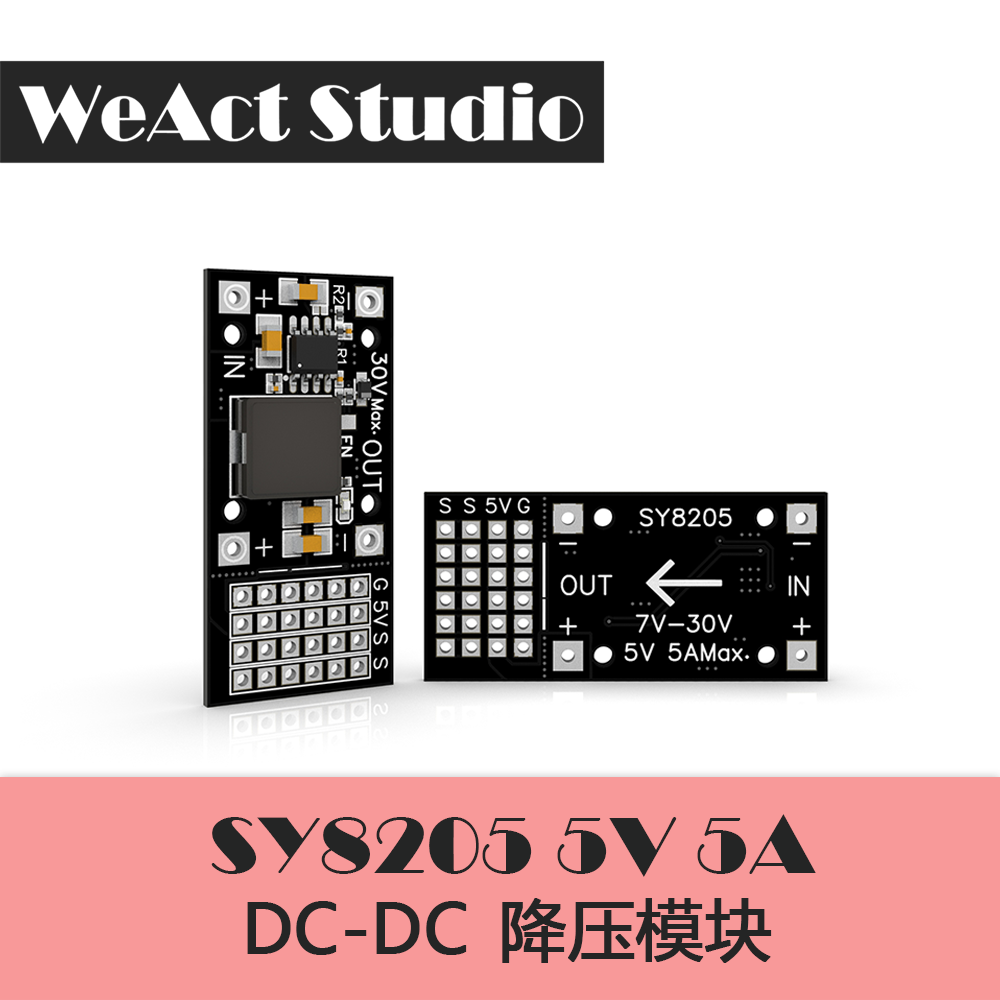

# WeAct Studio / 微行工作室

* [English Version](./README.md)

## 一个致力于设计独一无二电子模块的工作室

我们的板子背面都有`WeAct`的标志。STM32F4系列和STM32F1系列板子背面是`WeAct` && `版本号`，STM32H7系列板子背面是`WeAct Studio`，请大家认准我们的标志，多多支持我们！

## STM32F103C8T6 Bluebill Plus

* 72Mhz,20KB RAM,64KB ROM
* 无铅工艺，健康使用
* BluePill升级版
* USB C (type C) 接口，同时预留Flash焊盘
* Layout更优，地平面基本完整
* 使用最新原装ST芯片，高质量晶振
* 大按键设计，不用担心跳帽丢失，更方便
* 使用按键进入ISP模式更方便
* 支持Arduino开发,提供HID bootloader，通过简单的按键操作就可烧录程序，无需下载调试器

更多信息请访问：[BluePill-Plus](https://gitee.com/WeAct-TC/BluePill-Plus.git)

## STM32F4x1CEU6 core board

* STM32F401CEU6 84Mhz, 96KB RAM, 512KB ROM
* STM32F411CEU6 100Mhz, 128KB RAM, 512KB ROM
* 25MHZ 高速晶振 & 32.768Khz 6PF低速晶振
* 采用沉金工艺，使用无铅工艺，排针为镀金排针，更环保
* 已预留Flash焊盘，提供USBDisk&&FATFFS例程
* 支持MicroPython编程，提供可用的MicroPython固件
* 支持Arduino编程
* 支持C语言编程开发
* 版本为V3.0，有3个按钮，复位键，BOOT0键，用户按键
* 提供CMSIS-DAP固件，秒变下载烧录器
* 使用最新原装ST芯片，高质量晶振

更多信息请访问：[MiniF4-STM32F4x1](https://gitee.com/WeAct-TC/MiniF4-STM32F4x1.git)

## STM32H7xx core board

* STM32H750VBT6 480Mhz, 128KB ROM, 1MB RAM
* STM32H743VIT6 480Mhz, 2MB ROM, 1MB RAM
* ARM Cortex M7架构带FPU浮点单元，完整DSP指令和内存保护单元MPU
* 8MB SPI Flash, 8MB QSPI Flash(可运行程序)
* 采用沉金TG155板材，四层板设计
* 采用无铅焊接工艺
* 采用按键的形式设置BOOT
* 采用高质量晶振，金属外壳，均能良好起振
* 始终使用原装ST芯片
* USB C接口,Mirco SD卡座和按键均做ESD保护，DCMI摄像头接口，自带1.5V和2.8V电源，无需外接转接板，支持自动对焦功能
* 支持OpenMV4开发
* 支持C语言开发

更多信息请访问：[MiniSTM32H7xx](https://gitee.com/WeAct-TC/MiniSTM32H7xx.git)

## NVIDIA 英伟达 Jetson TX1 TX2 底板

* 本产品为 Nvidia Jetson TX2/TX2 4G/TX1 系列核心板的载板；
* 整版电源上电时序严格按照 Nvidia 推荐设计，带放电电路；
* 电源入口带欠压、过压、过流保护，使用更放心；
* 支持 1 路百兆自适应网口，用于网络调试、数据通信等；
* 支持 2 路 USB3.0，用于数据传输；
* 支持 3 路 USB2.0，其中 1 路 OTG 用于系统烧写，数据传输，另外 2 路为 HOST 用于数
据传输；
* 支持 1 路 HDMI（1080P），用于屏幕显示；
* 支持 1 路 MircoSD 卡，用于外挂 TF 卡，数据存储用；
* 支持 2 路 CAN、1 路 SPI、2 路 UART、4 路 IO 等接口，提供更方便的数据传输；
* 自带可选择上电自启动排针，满足更多的应用场景；
* 所有接口均带 ESD 防护，防止静电造成载板损坏；
* 体积极小的载板，结构紧凑，大小仅有 50mm*78mm，与核心板大小一致；
* 定期更新不同版本设备树，兼容不同 Tegra 内核版本。
* 可用于深度学习
* 机器视觉
* 实验室
* 机器人竞赛
* 无人机

更多信息请访问：[WeAct-TX1_2-CB](https://gitee.com/WeAct-TC/WeAct-TX1_2-CB.git)

## SY8205 降压模块

* 7V - 30V 电压输入
* 输入电源：7V - 30V,建议24V以下
* 输出电压：5V
* 输出电流：5A Max.
* 舵机电源驱动，可直接接舵机，掰断可当电源模块
* 采用同步整流，效率更高
* 电容采用大容量瓷片电容，不易损坏，发热更低
* 大电流大封装电感，进一步降低发热量

## TB67H450 电机驱动模块

* 输入电压: 40V，最大输出电流: 3A
* 连续输出电流: 2.2A
* 自带电流环，可以实现电流控制
