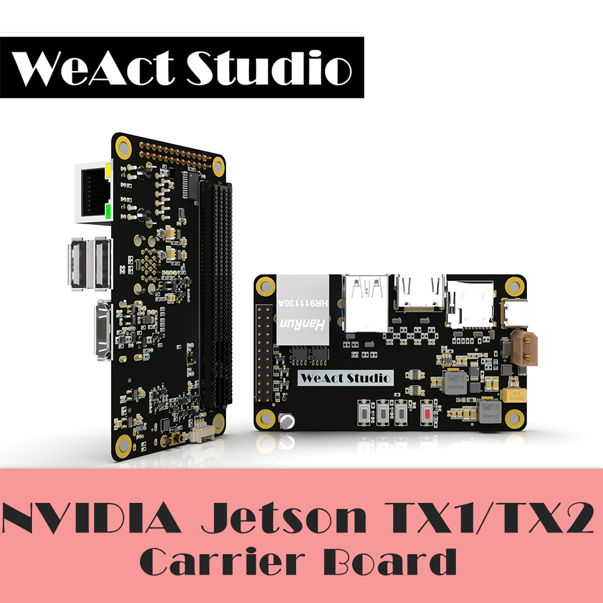
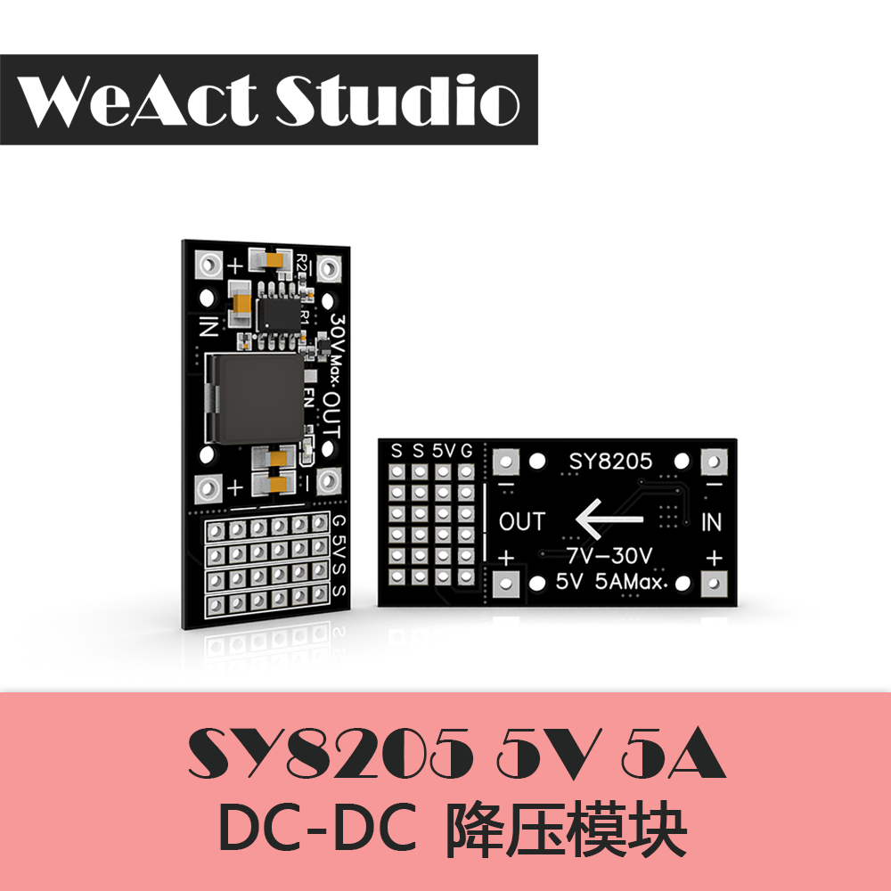

# WeAct Studio / 微行创新工作室

* [中文版本](./README-zh.md)

## A studio dedicated to designing unique electronic modules.

**We have the `WeAct` logo on the back of our boards. The back of STM32F4 series and STM32F1 series board is `WeAct` && `version number`, and the back of STM32H7 series board is `WeAct Studio`. Please recognize our logo, support us more, and refuse to pirate!**

## STM32F103C8T6 Bluebill Plus

* 72Mhz,20KB RAM,64KB ROM
* Lead-free process, healthy use
* BluePill Plus
* USB C (type C) Interface, while reserved Flash welding disk
* LayoutLayout is better, the ground plane is basically complete
* The use of the latest original ST chip, high quality crystal vibration
* Large key design, no need to worry about missing jump cap, more convenient
* It is more convenient to use the key to enter ISP mode
* Support Arduino development, provide HID Bootloader, through a simple keystroke operation can burn procedures, no need to download the debugger

For more information please visit:[BluePill-Plus](https://github.com/WeAct-TC/BluePill-Plus.git)

## STM32F4x1CEU6 core board

* STM32F401CEU6 84Mhz, 96KB RAM, 512KB ROM
* STM32F411CEU6 100Mhz, 128KB RAM, 512KB ROM
* 25MHZ high speed crystal oscillator & 32.768khz 6PF low speed crystal oscillator
* Gold sinking process is adopted, lead-free process is used, and the needle arrangement is gold-plated, which is more environmentally friendly
* Flash pads are reserved to provide USBDisk&&FATFFS routines
* Support for MicroPython programming with available MicroPython firmware
* Support for Arduino programming development
* Support C language programming development
* Version V3.0, there are 3 buttons, reset key, BOOT0 key, user key
* CMSIS-DAP firmware is available
* The use of the latest original ST chip, high quality crystal vibration

For more information please visit:[MiniF4-STM32F4x1](https://github.com/WeAct-TC/MiniF4-STM32F4x1.git)

## STM32H7xx core board

* STM32H750VBT6 480Mhz, 128KB ROM, 1MB RAM
* STM32H743VIT6 480Mhz, 2MB ROM, 1MB RAM
* ARM Cortex M7Architecture with FPU floating point unit, complete DSP instruction and memory protection unit MPU
* 8MB SPI Flash, 8MB QSPI Flash(Executable program)
* Gold sink TG155 plate, four layer plate design
* Lead-free welding process is adopted
* Use the button to set BOOT
* Using high quality crystal vibration, metal shell, can be good vibration
* Always use the original ST chip
* USB C interface,Mirco SD card seat and buttons all do ESD protection, DCMI camera interface, with 1.5V and 2.8V power supply, no external transfer board, support auto focus function
* Support for OpenMV4 development
* Support C language development

For more information visit:[MiniSTM32H7xx](https://github.com/WeAct-TC/MiniSTM32H7xx.git)

## NVIDIA Jetson TX1 TX2 motherboard

* This product is the carrier of Nvidia Jetson TX2/TX2 4G/TX1 series core plates;
* The whole version of the power supply is designed in strict accordance with the Nvidia recommended design, with discharge circuit;
* The power inlet is protected with undervoltage, overvoltage and overcurrent, so it can be used safely;
* Support 1 channel 100 MB adaptive network port, used for network debugging, data communication, etc.;
* Supports 2-way USB3.0 for data transmission;
* Support 3-channel USB2.0, in which 1 channel OTG is used for system writing and data transmission, and the other 2 channels HOST is used for number
According to the transmission;
* supports 1-channel HDMI (1080P) for screen display;
* Support 1 channel MircoSD card, used for TF card plug-in, data storage;
* Support 2-way CAN, 1-way SPI, 2-way UART, 4-way IO and other interfaces to provide more convenient data transmission;
* Equipped with optional power-on self-starting needle arrangement to meet more application scenarios;
* All interfaces are equipped with ESD protection to prevent damage to the carrier plate caused by static electricity;
* Small size, compact structure, size only 50mm*78mm, the same size as the core board;
* Periodically update the device tree of different versions to be compatible with different Tegra kernel versions.
* Can be used for deep learning
* Machine vision
* laboratory
* Robot Competition
* unmanned aerial vehicle (uav)

For more information visit:[WeAct-TX1_2-CB](https://github.com/WeAct-TC/WeAct-TX1_2-CB.git)

## SY8205 Step-down module

* 7V-30V voltage input
* Input power supply: 7V-30V, recommended below 24V
* Output voltage: 5V
* Output current: 5A Max.
* The steering gear is driven by power supply, which can be directly connected to the steering gear and broken as the power module
* Adopt synchronous rectification for higher efficiency
* Capacitor adopts large capacity ceramic chip capacitor, which is not easy to damage and has lower heating
* Large current and package inductance, further reducing calorimetry

## TB67H450 Motor drive module

* Input voltage: 40V, maximum output current: 3A
* Continuous output current: 2.2a
* With its own current loop, it can realize current control
